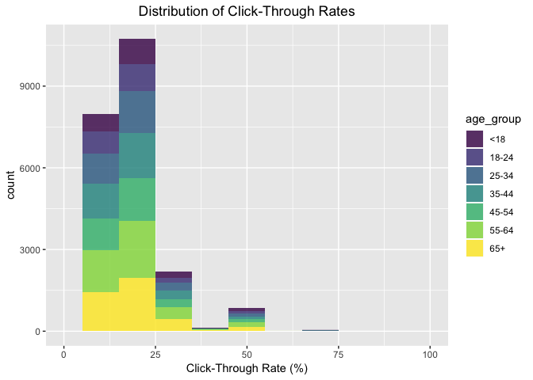
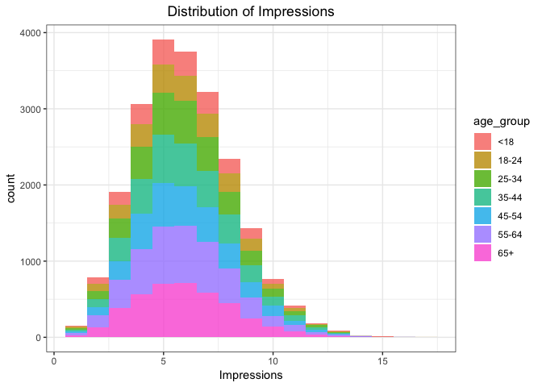
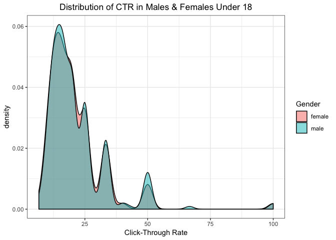

New York Times User Data from 2012
================
Sophia
31/10/2018

    ##   Age Gender Impressions Clicks Signed_In
    ## 1  36      0           3      0         1
    ## 2  73      1           3      0         1
    ## 3  30      0           3      0         1
    ## 4  49      1           3      0         1
    ## 5  47      1          11      0         1
    ## 6  47      0          11      1         1

Exercise 1
==========

    ##   Age Gender Impressions Clicks Signed_In age_group
    ## 1  36 female           3      0         1     35-44
    ## 2  73   male           3      0         1       65+
    ## 3  30 female           3      0         1     25-34
    ## 4  49   male           3      0         1     45-54
    ## 5  47   male          11      0         1     45-54
    ## 6  47 female          11      1         1     45-54

    ## [1] 0

Exercise 2
==========

    ##   Age_group Length Min_value Max_value     Mean Median
    ## 1       <18 150934         0        17  1.39826      0
    ## 2     18-24  40694        18        24 20.83332     21
    ## 3     25-34  62106        25        35 29.85135     30
    ## 4     35-44  66928        36        44 39.75874     40
    ## 5     45-54  64288        45        54 49.49258     49
    ## 6     55-64  44738        55        64 59.49819     60
    ## 7       65+  28753        65       108 72.98870     72

    ## Warning: package 'bindrcpp' was built under R version 3.4.4

    ## Warning: Removed 14 rows containing missing values (geom_bar).

 Explore the data and make visual and quantitative comparisons across user segments/demographics (&lt;18-year-old males versus &lt; 18-year-old females or logged-in versus not, for example).

    ## Joining, by = c("Age", "Gender", "Impressions", "Clicks", "Signed_In", "age_group", "click_rate", "ctr_cat")

    ## Warning: Ignoring unknown parameters: binwidth

    ## Warning: Width not defined. Set with `position_dodge(width = ?)`

    ## 
    ##  Welch Two Sample t-test
    ## 
    ## data:  click_rate by Gender
    ## t = 0.53602, df = 22028, p-value = 0.5919
    ## alternative hypothesis: true difference in means is not equal to 0
    ## 95 percent confidence interval:
    ##  -0.2184964  0.3829846
    ## sample estimates:
    ## mean in group female   mean in group male 
    ##             20.66462             20.58237

    ##     estimate estimate1 estimate2 statistic   p.value parameter   conf.low
    ## 1 0.08224413  20.66462  20.58237 0.5360249 0.5919468  22028.45 -0.2184964
    ##   conf.high                  method alternative
    ## 1 0.3829846 Welch Two Sample t-test   two.sided

    ## [1] 0.5919468

We can see that there is no significant difference between males and females in terms of click-through rates (p-value = 0.5919).
