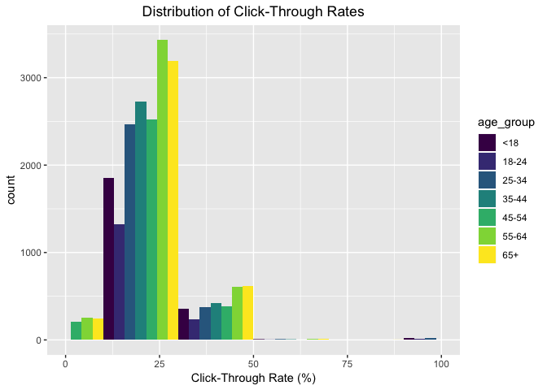
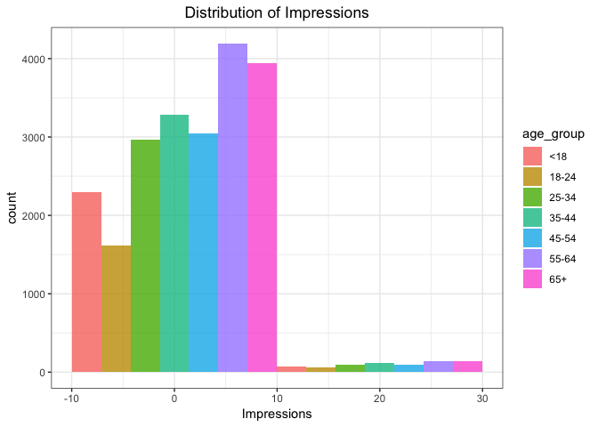
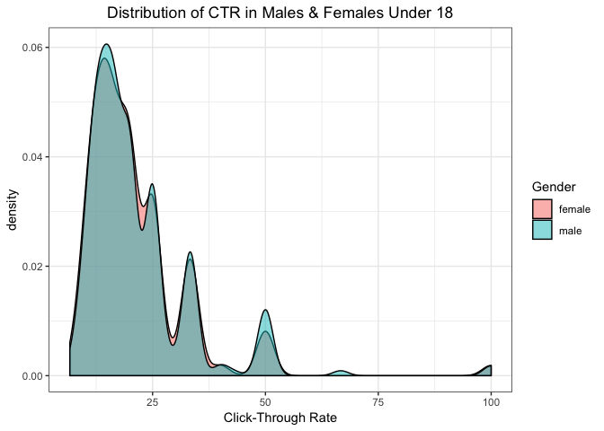

```r
# load data and packages
library(dplyr)
library(ggplot2)
library(doBy)
# colour palette
library(viridis)

data1 <- read.csv(url("https://stat.columbia.edu/~rachel/datasets/nyt1.csv"))
head(data1)
```

```
##   Age Gender Impressions Clicks Signed_In
## 1  36      0           3      0         1
## 2  73      1           3      0         1
## 3  30      0           3      0         1
## 4  49      1           3      0         1
## 5  47      1          11      0         1
## 6  47      0          11      1         1
```

# Exercise 1


```r
# Gender is coded as 0 = female, 1 = male
data1$Gender <- ifelse(data1$Gender == 0, "female", "male")

# create a new variable age_group
data1$age_group <- case_when(
  data1$Age <= 18 ~ "<18",
  data1$Age == 18 | data1$Age <= 24 ~ "18-24",
  data1$Age == 25 | data1$Age <= 35 ~ "25-34",
  data1$Age == 35 | data1$Age <= 44 ~ "35-44",
  data1$Age == 45 | data1$Age <= 54 ~ "45-54",
  data1$Age == 55 | data1$Age<= 64 ~ "55-64",
  data1$Age >= 65 ~ "65+")
head(data1)
```

```
##   Age Gender Impressions Clicks Signed_In age_group
## 1  36 female           3      0         1     35-44
## 2  73   male           3      0         1       65+
## 3  30 female           3      0         1     25-34
## 4  49   male           3      0         1     45-54
## 5  47   male          11      0         1     45-54
## 6  47 female          11      1         1     45-54
```

```r
# check for missing values
sum(is.na(data1))
```

```
## [1] 0
```
# Exercise 2

```r
# look at the descriptives
descriptives <- function(x){c(length(x), min(x),max(x), mean(x), median(x))}
group_stats <- summaryBy(Age~age_group, data =data1, FUN=descriptives)

# rename columns
colnames(group_stats) <- c("Age_group", "Length", "Min_value", "Max_value","Mean","Median")
print(group_stats)
```

```
##   Age_group Length Min_value Max_value      Mean Median
## 1       <18 156358         0        18  1.974168      0
## 2     18-24  35270        19        24 21.269039     21
## 3     25-34  62106        25        35 29.851351     30
## 4     35-44  66928        36        44 39.758741     40
## 5     45-54  64288        45        54 49.492580     49
## 6     55-64  44738        55        64 59.498189     60
## 7       65+  28753        65       108 72.988697     72
```

```r
# plot distributions of no. impressions and click-through-rate for these 6 age categories. click-through-rate, CTR = no. clicks/no. impressions
data1$click_rate <- (data1$Clicks/data1$Impressions)*100

## Filter dataset - exclude cases where there are no impressions nor clicks. only use data from users that are signed in
data1_filt <- data1 %>% filter(
         Clicks > 0,
         Impressions > 0,
         Signed_In == 1)
```

```
## Warning: package 'bindrcpp' was built under R version 3.4.4
```

```r
# plot CTR
ctr_plot <- ggplot(data1_filt, aes(x = click_rate, fill = age_group))+
  geom_histogram(binwidth =20,position = "dodge")+
  ggtitle("Distribution of Click-Through Rates") +
  xlab("Click-Through Rate (%)") +
  xlim(0, max(data1_filt$click_rate))+
  #theme_bw() +
  theme(plot.title = element_text(hjust = 0.5))+
  scale_fill_viridis(discrete = TRUE)
print(ctr_plot)
```

```
## Warning: Removed 8 rows containing missing values (geom_bar).
```

<!-- -->

```r
# plot for impressions
im_plot <- ggplot(data1_filt, aes(x = Impressions, fill = age_group)) +
  geom_histogram(binwidth =20, position = "dodge", alpha = 0.8)+
  ggtitle("Distribution of Impressions") +
  theme_bw() +
  theme(plot.title = element_text(hjust = 0.5))
print(im_plot)
```

<!-- -->

```r
# define new variable to segment or categorize users based on their click behaviour, low vs. high CTR
ctr_med <- median(data1_filt$click_rate)

data1_filt$ctr_cat <- ifelse(data1_filt$click_rate <= ctr_med, "low", "high")
```
Explore the data and make visual and quantitative comparisons across user segments/demographics (<18-year-old males versus < 18-year-old females or logged-in versus not, for example).


```r
u18_males <- data1_filt %>%
  filter(Gender == "male", Age < 18 )

u18_females <- data1_filt %>%
  filter(Gender == "female", Age < 18 )

u18 <- full_join(u18_females, u18_males)
```

```
## Joining, by = c("Age", "Gender", "Impressions", "Clicks", "Signed_In", "age_group", "click_rate", "ctr_cat")
```

```r
# group sizes
n_u18_males <- nrow(u18_males)
n_u18_females <- nrow(u18_females)

# group descriptives
male_table <- u18_males %>%
  group_by(Age) %>%
  summarise(n_males = n(),
            mean_CTR = mean(click_rate),
            med_CTR = median(click_rate))

female_table <- u18_females %>%
  group_by(Age) %>%
  summarise(n_females = n(),
            mean_CTR = mean(click_rate),
            med_CTR = median(click_rate))
# mean CTRs
mean_ctr_mal <- mean(u18_males$click_rate)
mean_ctr_fem <- mean(u18_females$click_rate)
sd_ctr_mal <- sd(u18_males$click_rate)
sd_ctr_fem <- sd(u18_females$click_rate)

# Distribution of CTR in both groups under 18 years
ctr_plot <- ggplot(u18, aes(x = u18$click_rate, fill = Gender)) +
  geom_density(binwidth =1, alpha = 0.5, position = "dodge")+
  ggtitle("Distribution of CTR in Males & Females Under 18") +
  xlab("Click-Through Rate") +
  theme_bw() +
  theme(plot.title = element_text(hjust = 0.5))
```

```
## Warning: Ignoring unknown parameters: binwidth
```

```r
print(ctr_plot)
```

```
## Warning: Width not defined. Set with `position_dodge(width = ?)`
```

<!-- -->

```r
#Compare two groups' CTRs
t.test(click_rate~Gender, data = data1_filt)
```

```
## 
## 	Welch Two Sample t-test
## 
## data:  click_rate by Gender
## t = 0.53602, df = 22028, p-value = 0.5919
## alternative hypothesis: true difference in means is not equal to 0
## 95 percent confidence interval:
##  -0.2184964  0.3829846
## sample estimates:
## mean in group female   mean in group male 
##             20.66462             20.58237
```

```r
t_test <- t.test(click_rate~Gender, data = data1_filt)
tidy_ttest <- broom::tidy(t_test)
tidy_ttest
```

```
##     estimate estimate1 estimate2 statistic   p.value parameter   conf.low
## 1 0.08224413  20.66462  20.58237 0.5360249 0.5919468  22028.45 -0.2184964
##   conf.high                  method alternative
## 1 0.3829846 Welch Two Sample t-test   two.sided
```

```r
print(tidy_ttest$p.value)
```

```
## [1] 0.5919468
```
We can see that there is no significant difference between males and females in terms of click-through rates (p-value = 0.5919).
