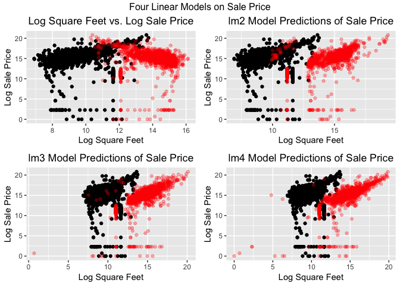
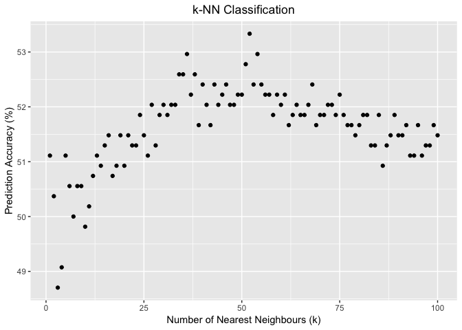
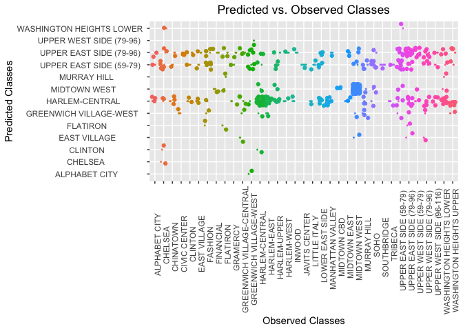

Exercise: Basic Machine Learning Algorithms
================
Sophia
20/11/2018

Manhattan Rolling Sales File (August 2012 - August 2013) <https://www.tripsavvy.com/sales-data-for-nyc-real-estate-2819364>

``` r
suppressPackageStartupMessages(library(dplyr))
library(ggplot2)
suppressPackageStartupMessages(library(gridExtra))
library(class)
library(caret)
```

    ## Loading required package: lattice

``` r
manhattan <- read.csv("rollingsales_manhattan.csv")
```

1) Analyze sales using regression with any predictors you feel are relevant. Justify why regression was appropriate to use.
===========================================================================================================================

2) Visualize the coefficients and fitted model.
===============================================

``` r
# remove dollar signs and commas
manhattan$SALE.PRICE.N = as.numeric(gsub("[\\$ ,]", "", manhattan$SALE.PRICE))
manhattan$GROSS.SQUARE.FEET = as.numeric(gsub("[:,:]", "", manhattan$GROSS.SQUARE.FEET))
manhattan$LAND.SQUARE.FEET = as.numeric(gsub("[:,:]", "", manhattan$LAND.SQUARE.FEET))

# change date to Date type
manhattan$SALE.DATE <- as.Date(manhattan$SALE.DATE, format ="%d/%m/%Y")

# change measurements to numeric type
manhattan$GROSS.SQUARE.FEET <- as.numeric(as.character(manhattan$GROSS.SQUARE.FEET))
manhattan$LAND.SQUARE.FEET <-  as.numeric(as.character(manhattan$LAND.SQUARE.FEET))

subset <- manhattan %>%
  select(SALE.PRICE.N, SALE.DATE,GROSS.SQUARE.FEET,
         LAND.SQUARE.FEET, TAX.CLASS.AT.TIME.OF.SALE,
         NEIGHBORHOOD, BUILDING.CLASS.CATEGORY)%>%
  filter(SALE.PRICE.N > 0, LAND.SQUARE.FEET > 0, GROSS.SQUARE.FEET > 0)%>%
  arrange(desc(SALE.DATE))

subset$log.sale.price <- log(subset$SALE.PRICE.N)
subset$log.gross.sq.ft <- log(subset$GROSS.SQUARE.FEET)
subset$log.land.sq.ft <- log(subset$GROSS.SQUARE.FEET)

# Linear model looking at effect of gross square feet of property with sale prices. 
lm1 <- lm(log.sale.price ~ log.gross.sq.ft, data = subset)
summary(lm1) 
# We can see that our model does not fit well Adj R-squared of 0.2013
# and it predicts a negative correlation instead of a positive one as seen in the data. 
p_val <- summary(lm1)$coefficients[2,4]  

# Save predictions and residuals of model 2
subset$pred_lm1 <- predict(lm1)
subset$resid_lm1 <- residuals(lm1)

# Center plot titles
theme_update(plot.title = element_text(hjust = 0.5))

plot1 <- ggplot(subset, aes(x = log.gross.sq.ft, y = log.sale.price)) +
  geom_point() +
  xlab("Log Square Feet") + 
  ylab("Log Sale Price") +
  ggtitle("Log Square Feet vs. Log Sale Price") + 
  geom_point(color='red',data = subset,
             aes(x = pred_lm1, y= log.sale.price), alpha = 0.3)
```

``` r
# Another linear model - looking at multiple variables
lm2 <- lm(log.sale.price ~ log.gross.sq.ft +
            log.land.sq.ft + factor(NEIGHBORHOOD) , data = subset)
summary(lm2) # Adjusted R-squared:  0.5293, better fit than model 1
p_val2 <- summary(lm2)$coefficients[2,4]
# plot(resid(lm2))

predicted_df2 <- data.frame(sales_predict2 = predict(lm2, subset))
```

    ## Warning in predict.lm(lm2, subset): prediction from a rank-deficient fit
    ## may be misleading

``` r
plot2 <- ggplot(subset, aes(x = log.gross.sq.ft, y = log.sale.price)) + 
  xlab("Log Square Feet") + 
  ylab("Log Sale Price") +
  ggtitle("lm2 Model Predictions of Sale Price") + 
  geom_point() +
  geom_point(color='red',data = predicted_df2,
             aes(x=sales_predict2, y=subset$log.sale.price), alpha = 0.3)
```

``` r
# Add another variable, building type
lm3 <- lm(log.sale.price ~ log.gross.sq.ft +
            log.land.sq.ft + factor(NEIGHBORHOOD) + BUILDING.CLASS.CATEGORY, data = subset)
summary(lm3) #even better Adjusted R-squared: 0.6217

predicted_df3 <- data.frame(sales_predict3 = predict(lm3, subset))
```

    ## Warning in predict.lm(lm3, subset): prediction from a rank-deficient fit
    ## may be misleading

``` r
plot3 <- ggplot(subset, aes(x = log.gross.sq.ft, y = log.sale.price)) + 
  geom_point() +
  xlab("Log Square Feet") + 
  ylab("Log Sale Price") +
  ggtitle("lm3 Model Predictions of Sale Price") + 
  geom_point(color='red',data = predicted_df3,
             aes(x=sales_predict3, y=subset$log.sale.price), alpha = 0.3)

# model with interaction between neighbourhood and building type
lm4 <- lm(log.sale.price ~ log.gross.sq.ft +
            log.land.sq.ft + factor(NEIGHBORHOOD)* BUILDING.CLASS.CATEGORY, data = subset)
summary(lm4) #even better Adjusted R-squared: 0.6565

predicted_df4 <- data.frame(sales_predict4 = predict(lm4, subset))
```

    ## Warning in predict.lm(lm4, subset): prediction from a rank-deficient fit
    ## may be misleading

``` r
plot4 <- ggplot(subset, aes(x = log.gross.sq.ft, y = log.sale.price)) + 
  geom_point() +
  xlab("Log Square Feet") + 
  ylab("Log Sale Price") +
  ggtitle("lm4 Model Predictions of Sale Price") + 
  geom_point(color='red',data = predicted_df4,
             aes(x=sales_predict4, y=subset$log.sale.price), alpha = 0.3)

grid.arrange(grobs = list(plot1, plot2, plot3, plot4), cols=2, top="Four Linear Models on Sale Price")
```

 \# Model Comparison Here we can see that we have significantly improved the model by adding more factors on sale price.

``` r
anova(lm1,lm2)
```

    ## Analysis of Variance Table
    ## 
    ## Model 1: log.sale.price ~ log.gross.sq.ft
    ## Model 2: log.sale.price ~ log.gross.sq.ft + log.land.sq.ft + factor(NEIGHBORHOOD)
    ##   Res.Df   RSS Df Sum of Sq     F    Pr(>F)    
    ## 1   2757 17331                                 
    ## 2   2720 10077 37    7254.2 52.92 < 2.2e-16 ***
    ## ---
    ## Signif. codes:  0 '***' 0.001 '**' 0.01 '*' 0.05 '.' 0.1 ' ' 1

``` r
anova(lm2, lm3)
```

    ## Analysis of Variance Table
    ## 
    ## Model 1: log.sale.price ~ log.gross.sq.ft + log.land.sq.ft + factor(NEIGHBORHOOD)
    ## Model 2: log.sale.price ~ log.gross.sq.ft + log.land.sq.ft + factor(NEIGHBORHOOD) + 
    ##     BUILDING.CLASS.CATEGORY
    ##   Res.Df     RSS Df Sum of Sq      F    Pr(>F)    
    ## 1   2720 10077.2                                  
    ## 2   2696  8026.8 24    2050.4 28.695 < 2.2e-16 ***
    ## ---
    ## Signif. codes:  0 '***' 0.001 '**' 0.01 '*' 0.05 '.' 0.1 ' ' 1

``` r
anova(lm3, lm4)
```

    ## Analysis of Variance Table
    ## 
    ## Model 1: log.sale.price ~ log.gross.sq.ft + log.land.sq.ft + factor(NEIGHBORHOOD) + 
    ##     BUILDING.CLASS.CATEGORY
    ## Model 2: log.sale.price ~ log.gross.sq.ft + log.land.sq.ft + factor(NEIGHBORHOOD) * 
    ##     BUILDING.CLASS.CATEGORY
    ##   Res.Df    RSS  Df Sum of Sq      F    Pr(>F)    
    ## 1   2696 8026.8                                   
    ## 2   2465 6664.9 231    1361.8 2.1804 < 2.2e-16 ***
    ## ---
    ## Signif. codes:  0 '***' 0.001 '**' 0.01 '*' 0.05 '.' 0.1 ' ' 1

3) Predict the neighborhood using a k-NN classifier. Be sure to withhold a subset of the data for testing. Find the variables and the k that give you the lowest prediction error.
----------------------------------------------------------------------------------------------------------------------------------------------------------------------------------

``` r
# only keep sale prices above $10,000
subset <- subset %>% 
  filter(SALE.PRICE.N > 10000)

subset$SALE.DATE <- as.integer(subset$SALE.DATE)

set.seed(1234)
# 80 % train, 20 % test split of the data 
split = sort(sample(nrow(subset), nrow(subset)*.8))

# training set
train <- subset[split,]
# test set
test <- subset[-split,]

# Compare the rates of accuracy for predicting correct neighbourhood depending on k values.
results <- c()
for (k in 1:100){
  predictions <- knn(train=train[,1:5], test=test[,1:5], cl=train[,6], k = k)
  cm <- confusionMatrix(predictions, test[,6])
  accuracy <- cm$overall['Accuracy']
  results <- c(results, accuracy)
}
ggplot(as.data.frame(results), aes(x = 1:100, y = results*100)) + 
  geom_point()+
  ggtitle("k-NN Classification")+
  xlab("Number of Nearest Neighbours (k)")+
  ylab("Prediction Accuracy (%)")
```



``` r
best_k <- order(results)
```

Report and visualize your findings.
-----------------------------------

``` r
# Use k with the lowest error rate, 53
predictions <- knn(train=train[,1:5], test=test[,1:5], cl=train[,6], k = 53)
qplot(test$NEIGHBORHOOD, predictions, data=test,
      colour= test$NEIGHBORHOOD,
      geom = c("boxplot", "jitter"),
      main = "Predicted vs. Observed Classes",
      xlab = "Observed Classes",
      ylab = "Predicted Classes",
      show.legend = FALSE)+
  theme(axis.text.x = element_text(angle = 90, hjust = 1))
```


