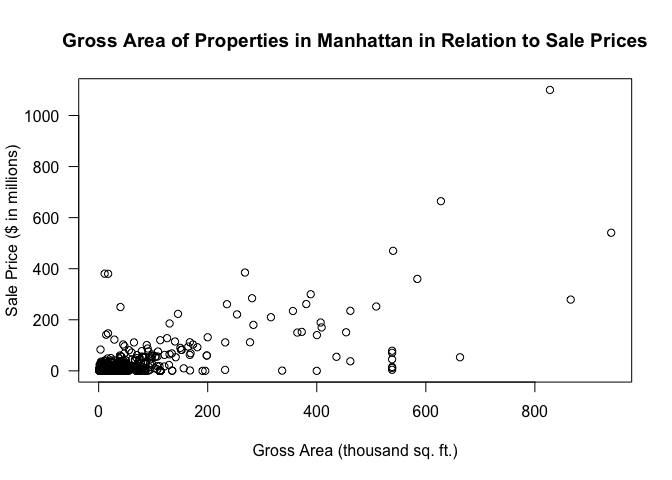
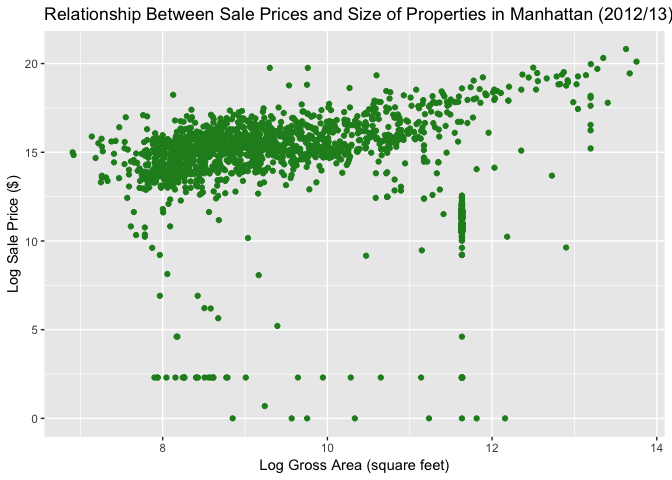
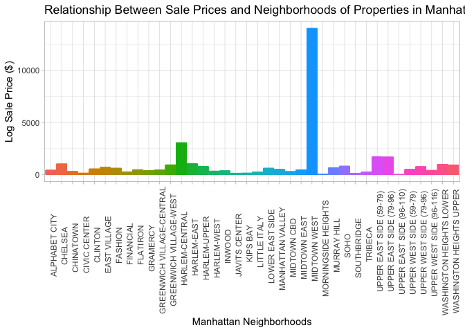
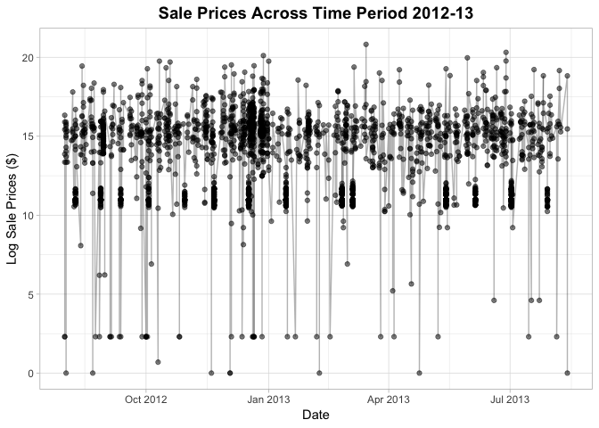
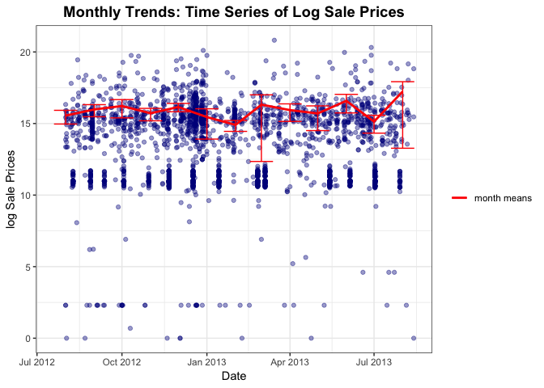
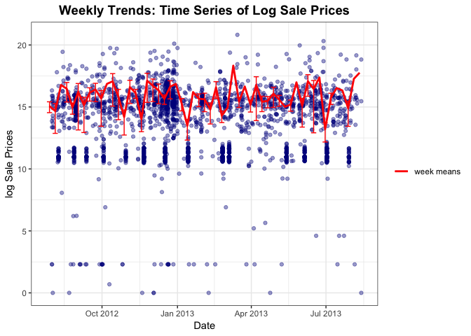

Real Direct Data Strategy
================
Sophia
03/11/2018

Manhattan Rolling Sales File (August 2012 - August 2013)
========================================================

-   Sales File as of 08/30/2013 Coop Sales Files as of 09/18/2013
-   Neighborhood Name 09/06/13, Descriptive Data is as of 06/01/13
-   Building Class Category is based on Building Class at Time of Sale.

Load & Clean Data
=================

``` r
# load data
manhattan <- read.csv("rollingsales_manhattan.csv")
```

Cleaning & Formatting
---------------------

    ## # A tibble: 25,783 x 21
    ##    BOROUGH NEIGHBORHOOD BUILDING.CLASS.… TAX.CLASS.AT.PR… BLOCK   LOT
    ##      <int> <fct>        <fct>            <fct>            <int> <int>
    ##  1       1 "KIPS BAY  … "31  COMMERCIAL… 4                  967     1
    ##  2       1 "LITTLE ITA… "01  ONE FAMILY… 1                  471     1
    ##  3       1 "UPPER EAST… "10  COOPS - EL… 2                 1381     1
    ##  4       1 "UPPER EAST… "10  COOPS - EL… 2                 1381     1
    ##  5       1 "UPPER EAST… "10  COOPS - EL… 2                 1381     1
    ##  6       1 "UPPER EAST… "10  COOPS - EL… 2                 1381     1
    ##  7       1 "TRIBECA   … "10  COOPS - EL… 2                  140     1
    ##  8       1 "TRIBECA   … "10  COOPS - EL… 2                  140     1
    ##  9       1 "TRIBECA   … "10  COOPS - EL… 2                  140     1
    ## 10       1 "SOUTHBRIDG… "33  EDUCATIONA… 4                  102     1
    ## # ... with 25,773 more rows, and 15 more variables: EASE.MENT <lgl>,
    ## #   BUILDING.CLASS.AT.PRESENT <fct>, ADDRESS <fct>,
    ## #   APART.MENT.NUMBER <fct>, ZIP.CODE <int>, RESIDENTIAL.UNITS <fct>,
    ## #   COMMERCIAL.UNITS <int>, TOTAL.UNITS <fct>, LAND.SQUARE.FEET <fct>,
    ## #   GROSS.SQUARE.FEET <fct>, YEAR.BUILT <int>,
    ## #   TAX.CLASS.AT.TIME.OF.SALE <dbl>, BUILDING.CLASS.AT.TIME.OF.SALE <fct>,
    ## #   SALE.PRICE <fct>, SALE.DATE <fct>

Exploratory Analyses
--------------------

``` r
# Let's look at the sales
options(scipen=999)
plot(x = (manhattan.sales$GROSS.SQUARE.FEET)/1000, y = (manhattan.sales$SALE.PRICE.N)/1000000,
     xlab = "Gross Area (thousand sq. ft.)", ylab = "Sale Price ($ in millions)", main = "Gross Area of Properties in Manhattan in Relation to Sale Prices", las = 1)
```



``` r
ggplot(data = manhattan.sales, aes(log(manhattan.sales$GROSS.SQUARE.FEET), log(manhattan.sales$SALE.PRICE.N)))+
  labs(title = 'Relationship Between Sale Prices and Size of Properties in Manhattan (2012/13)',x = 'Log Gross Area (square feet)', y= 'Log Sale Price ($)')+
  geom_point(colour = 'forest green')
```



``` r
# sales prices by neighborhood
sales_table <- manhattan.sales %>%
  select(-newdate) %>%
  group_by(NEIGHBORHOOD) %>%
  summarise(
    `mean price` = mean(SALE.PRICE.N, na.rm = TRUE),
    `sd price` = sd(SALE.PRICE.N, na.rm = TRUE)
    ) %>%
  arrange(desc(`mean price`))

ggplot(data = manhattan.sales, aes(manhattan.sales$NEIGHBORHOOD, log(manhattan.sales$SALE.PRICE.N), color = NEIGHBORHOOD))+
  labs(title = 'Relationship Between Sale Prices and Neighborhoods of Properties in Manhattan (2012/13)',x = 'Manhattan Neighborhoods', y= 'Log Sale Price ($)')+
  theme_light()+
  theme(axis.text.x = element_text(angle = 90, hjust = 1), legend.position="none")+
  geom_bar(stat="identity")
```



``` r
# Sales over time 
ggplot(data = manhattan.sales, aes(x = newdate, y= log(SALE.PRICE.N))) +
  geom_point(alpha = 0.5)+
  geom_line(alpha = 0.3)+
  xlab('Date')+ ylab('Log Sale Prices ($)')+
  ggtitle('Sale Prices Across Time Period 2012-13')+
  theme_light()+
  theme(plot.title = element_text(size = 14, face = "bold", color = "black", hjust = 0.5))
```



``` r
# value 1.96 for estimating 97.5 percentile
z_star <- qnorm(0.975)

# Monthly trends
month_summary <- manhattan.sales %>%
  group_by(month = floor_date(newdate, "month")) %>%
  summarize(n = n(),
            mean = mean(SALE.PRICE.N),
            sd = sd(SALE.PRICE.N),
            lower = mean(SALE.PRICE.N) - z_star * (sd / sqrt(n)),
            upper = mean(SALE.PRICE.N) + z_star * (sd / sqrt(n)))


ggplot(manhattan.sales, aes(x=newdate, y=log(SALE.PRICE.N))) + 
  geom_point(alpha = 0.4, colour ="darkblue") +
  geom_line(data = month_summary, aes(x = month, y = log(mean), colour = "red"), size =1)+
  geom_errorbar(data = month_summary, aes(x = month, y = log(sd),ymin= log(upper), ymax= log(lower), colour = "red"), size = 0.5)+
  scale_colour_manual(labels = c("month means","error bars"),
                      values = c("red", "red"))+
  labs(x = "Date", y = 'log Sale Prices', colour = " ", title = "Monthly Trends: Time Series of Log Sale Prices")+
  theme_bw()+
  theme(plot.title = element_text(size = 14, face = "bold", color = "black", hjust = 0.5))
```

    ## Warning: Ignoring unknown aesthetics: y



``` r
#TODO weekly trends
week_summary <- manhattan.sales %>%
  group_by(week = floor_date(newdate, "week")) %>%
  summarize(n = n(),
            mean = mean(SALE.PRICE.N),
            sd = sd(SALE.PRICE.N),
            lower = mean(SALE.PRICE.N) - z_star * (sd / sqrt(n)),
            upper = mean(SALE.PRICE.N) + z_star * (sd / sqrt(n)))

ggplot(manhattan.sales, aes(x=newdate, y=log(SALE.PRICE.N))) + 
  geom_point(alpha = 0.4, colour ='darkblue') +
  geom_line(data = week_summary, aes(x = week, y = log(mean), colour = "red"), size =1)+
  geom_errorbar(data = week_summary, aes(x = week, y = log(sd),ymin= log(upper), ymax= log(lower), colour = "red"), size = 0.5)+
  scale_colour_manual(values = c("red", "red"), labels = c("week means","error bars"))+
  labs(x = "Date", y = 'log Sale Prices', colour = " ", title = "Weekly Trends: Time Series of Log Sale Prices")+
  theme_bw()+
  theme(plot.title = element_text(size = 14, face = "bold", color = "black", hjust = 0.5))
```

    ## Warning: Ignoring unknown aesthetics: y

    ## Warning in log(lower): NaNs produced

    ## Warning: Removed 14 rows containing missing values (geom_errorbar).

 \#\#
